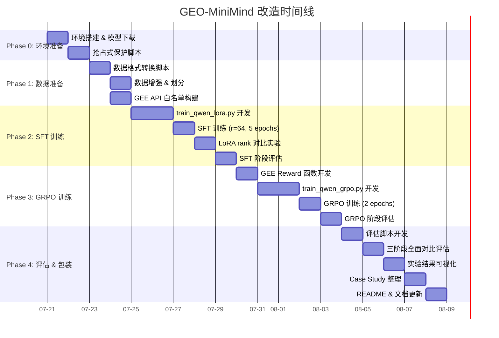

# GEO-MiniMind 项目改造规划

> **项目定位**：基于自然语言生成 Google Earth Engine (GEE) 分析代码的领域大模型  
> **简历亮点**：SFT + GRPO 强化学习后训练 pipeline，Qwen2.5-Coder-0.5B 为基座，LoRA 高效微调  
> **创建日期**：2026-07-21

---

## 一、项目现状盘点

### 1.1 代码架构（基于 MiniMind 开源框架）

```
geo-minimind/
├── data/                          # GEE 领域数据集（核心资产）
│   ├── gee_sft_dataset.jsonl      # SFT 数据：1305 条，1.0MB（API 问答）
│   ├── gee_agentic_rl_dataset.jsonl # RL 数据：2068 条，4.7MB（agentic trajectory）
│   ├── arl_sft_converted.jsonl    # RL→SFT 转换数据：1289 条，2.7MB
│   ├── arl_api_complex.jsonl      # 复杂 API 用法：616 条，1.5MB
│   └── arl_examples_debug.jsonl   # 含 debug 路径的示例：165 条，0.5MB
├── model/
│   ├── model_minimind.py          # MiniMind 模型架构（自定义 Transformer）
│   ├── model_lora.py              # LoRA 实现（rank=16, apply/save/load/merge）
│   ├── tokenizer.json             # MiniMind 自带 tokenizer (vocab_size=6400)
│   └── tokenizer_config.json
├── trainer/
│   ├── train_lora.py              # LoRA 微调训练脚本
│   ├── train_grpo.py              # GRPO 强化学习训练脚本
│   ├── train_agent.py             # Agent RL 训练脚本（tool calling）
│   ├── train_full_sft.py          # 全参数 SFT
│   ├── train_pretrain.py          # 预训练脚本
│   ├── train_ppo.py               # PPO 训练
│   ├── train_dpo.py               # DPO 训练
│   ├── train_distillation.py      # 蒸馏训练
│   ├── rollout_engine.py          # GRPO rollout 引擎
│   └── trainer_utils.py           # 工具函数
├── dataset/
│   └── lm_dataset.py              # 数据集类（SFTDataset, RLAIFDataset, AgentRLDataset）
├── scripts/
│   ├── eval_toolcall.py           # 工具调用评估
│   ├── serve_openai_api.py        # OpenAI 兼容 API 服务
│   ├── web_demo.py                # Web 演示
│   └── ...
├── eval_llm.py                    # 模型推理评估脚本
└── requirements.txt               # 依赖清单
```

### 1.2 数据资产详细分析

| 数据文件 | 条数 | 大小 | 格式 | 用途 |
|---------|------|------|------|------|
| `gee_sft_dataset.jsonl` | 1,305 | 1.0MB | `{instruction, output}` | API 文档问答 SFT |
| `gee_agentic_rl_dataset.jsonl` | 2,068 | 4.7MB | agentic trajectory (含 thought/action/observation) | 强化学习训练 |
| `arl_sft_converted.jsonl` | 1,289 | 2.7MB | trajectory → SFT 格式 | SFT 数据补充 |
| `arl_api_complex.jsonl` | 616 | 1.5MB | 复杂多步 trajectory | 复杂代码生成 RL |
| `arl_examples_debug.jsonl` | 165 | 0.5MB | 含 debug 路径的 trajectory | debug 能力 RL |

**数据类型分布**：
- **TypeA - 纯代码生成**：输入自然语言需求 → 输出 GEE Python 代码（`arl_examples_debug`, `arl_api_complex`）
- **TypeB - API 文档问答**：输入 API 名称 → 输出 API 说明 + 用法（`gee_sft_dataset`）
- **TypeC - Agentic 多步推理**：输入任务描述 → 多步 thought-action-observation → 最终代码（`gee_agentic_rl_dataset`）

### 1.3 当前框架优缺点

| 维度 | 优势 | 不足 |
|------|------|------|
| **模型** | MiniMind 架构精简、代码清晰 | vocab_size=6400 太小，无法处理代码场景 |
| **训练** | 已有 LoRA/GRPO/Agent RL 完整 pipeline | 训练脚本针对 MiniMind 架构，需适配 Qwen |
| **数据** | GEE 领域数据质量高、多种训练格式 | SFT 数据量偏少（1305条），需数据增强 |
| **评估** | 有基础推理脚本 | 缺少系统化评估指标和自动化评测 |

---

## 二、改造核心方案：换用 Qwen2.5-Coder-0.5B

### 2.1 为什么选 Qwen2.5-Coder-0.5B

| 对比维度 | MiniMind (原) | Qwen2.5-Coder-0.5B (改造后) |
|---------|--------------|---------------------------|
| 参数量 | ~26M (hidden=768) | 494M |
| Vocab Size | 6,400 | 151,936 (含代码 token) |
| 代码能力 | 几乎无 | 预训练含大量代码语料 |
| Tokenizer | 自定义，代码效率低 | 基于 Qwen，代码 token 覆盖全 |
| 生态兼容 | 自定义架构 | HuggingFace 原生支持、PEFT 直接用 |
| 推理速度 | 快 | 0.5B 仍可单卡推理 |

### 2.2 技术方案概览

```
┌─────────────────────────────────────────────────────────────────┐
│                    GEO-MiniMind 训练 Pipeline                    │
├─────────────────────────────────────────────────────────────────┤
│                                                                  │
│  ┌──────────┐    ┌──────────────┐    ┌───────────────────┐      │
│  │ 数据准备  │───▶│  阶段1: SFT   │───▶│  阶段2: GRPO RL   │     │
│  │          │    │  LoRA 微调    │    │  强化学习后训练    │      │
│  └──────────┘    └──────────────┘    └───────────────────┘      │
│       │                │                      │                  │
│       ▼                ▼                      ▼                  │
│  gee_sft +         SFT Model            GRPO Model              │
│  arl_sft_conv      (LoRA adapter)       (Full/LoRA weights)     │
│                                                                  │
│  ┌──────────────────────────────────────────────────────────┐   │
│  │                    阶段3: 评估 & 对比                      │   │
│  │  • Base vs SFT vs GRPO 三阶段对比                         │   │
│  │  • 代码语法正确率、API 调用准确率、任务完成率              │   │
│  │  • 人工评估 + 自动评估                                    │   │
│  └──────────────────────────────────────────────────────────┘   │
└─────────────────────────────────────────────────────────────────┘
```

---

## 三、详细实施步骤

### 3.1 Phase 0：环境准备与模型下载

#### 3.1.1 环境依赖

```bash
# 基础依赖（在 requirements.txt 基础上新增）
pip install peft>=0.12.0         # HuggingFace PEFT (LoRA)
pip install trl>=0.13.0          # TRL 库 (GRPO/PPO 训练框架备选)
pip install transformers>=4.57.0 # Qwen 模型支持
pip install bitsandbytes>=0.43   # 量化支持（可选）
pip install accelerate>=0.34.0   # 加速训练
pip install wandb                # 实验追踪
pip install rouge-score          # 评估指标
pip install codebleu             # 代码评估（CodeBLEU）
```

#### 3.1.2 下载 Qwen2.5-Coder-0.5B

```bash
# 从 ModelScope 下载（国内网络友好）
python -c "
from modelscope import snapshot_download
snapshot_download('Qwen/Qwen2.5-Coder-0.5B-Instruct', cache_dir='./pretrained_models')
"

# 或从 HuggingFace 下载
# huggingface-cli download Qwen/Qwen2.5-Coder-0.5B-Instruct --local-dir ./pretrained_models/Qwen2.5-Coder-0.5B-Instruct
```

#### 3.1.3 抢占式服务器数据保护策略

> [!CAUTION]
> 服务器为抢占式实例，随时可能被回收！必须做好以下防护措施：

```bash
# 1. 每 N 步自动保存 checkpoint（训练脚本已内置 save_interval）
# 2. 训练脚本支持 --from_resume 1 断点续训
# 3. 关键产出文件实时同步到持久化存储
mkdir -p /root/autodl-tmp/geo-minimind-ckpts  # AutoDL 持久化目录（示例）

# 4. 添加自动同步脚本
cat > sync_ckpts.sh << 'EOF'
#!/bin/bash
while true; do
    rsync -av --progress ./out/ /root/autodl-tmp/geo-minimind-ckpts/out/ 2>/dev/null
    rsync -av --progress ./checkpoints/ /root/autodl-tmp/geo-minimind-ckpts/checkpoints/ 2>/dev/null
    rsync -av --progress ./eval_results/ /root/autodl-tmp/geo-minimind-ckpts/eval_results/ 2>/dev/null
    sleep 300  # 每 5 分钟同步一次
done
EOF
chmod +x sync_ckpts.sh
# 后台运行: nohup ./sync_ckpts.sh &

# 5. 训练脚本增加信号捕获（SIGTERM），抢占回收时紧急保存
```

### 3.2 Phase 1：数据准备与格式转换

#### 3.2.1 SFT 数据统一格式

需要将所有 SFT 数据转换为 Qwen chat template 统一格式：

```json
{
  "conversations": [
    {"role": "system", "content": "你是 GEE-Coder，一个专注于 Google Earth Engine Python API 的代码生成助手。"},
    {"role": "user", "content": "在 GEE Python API 中，如何使用 Image.reduceRegion 方法对北京地区计算影像指定区域的像元均值？"},
    {"role": "assistant", "content": "```python\nimport ee\nee.Initialize()\n\ngeom = ee.Geometry.Point([116.4, 39.9]).buffer(10000)\nimg = ee.Image('USGS/SRTMGL1_003')\nresult = img.reduceRegion(reducer=ee.Reducer.mean(), geometry=geom, scale=30)\nprint(result.getInfo())\n```"}
  ]
}
```

#### 3.2.2 数据转换脚本 `scripts/convert_data_for_qwen.py`

需新建此脚本，主要逻辑：

```python
"""
数据转换策略：
1. gee_sft_dataset.jsonl (1305条)
   - instruction → user, output → assistant
   - 添加 GEE 领域 system prompt

2. arl_sft_converted.jsonl (1289条)
   - 已有 trajectory 格式，提取 user_goal → user, final_answer → assistant

3. arl_api_complex.jsonl (616条) 
   - 复杂代码生成，提取 user_goal 和 final_answer

4. arl_examples_debug.jsonl (165条)
   - 含 debug 路径的示例，全部提取为 SFT 数据

合计约 3,375 条 SFT 训练数据
"""

# 数据增强策略：
# - 对每条数据生成 2-3 种不同表述的 instruction（改写/简化/详细化）
# - 添加 "请用 GEE Python API 实现..." 等前缀变体
# - 随机调整代码注释的详细程度
# 增强后预计: ~6,000-8,000 条
```

#### 3.2.3 RL 数据格式化

GRPO 训练需要的数据格式（`RLAIFDataset` 兼容）：

```json
{
  "conversations": [
    {"role": "system", "content": "你是 GEE-Coder..."},
    {"role": "user", "content": "使用 GEE Python API 计算北京 2023 年的年均 NDVI..."},
    {"role": "assistant", "content": ""}
  ]
}
```

需要从 `gee_agentic_rl_dataset.jsonl` (2068条) 提取 `user_goal` 作为 prompt，训练时模型自行生成 response 并由 reward model 打分。

#### 3.2.4 数据集划分

```
总数据:
├── SFT 训练集: ~5,400 条 (80%)
├── SFT 验证集: ~675 条 (10%)
├── SFT 测试集: ~675 条 (10%)
│
├── RL 训练集: ~1,650 条 (80% of 2068)
└── RL 测试集: ~418 条 (20% of 2068)
```

### 3.3 Phase 2：SFT LoRA 微调

#### 3.3.1 新建训练脚本 `trainer/train_qwen_lora.py`

基于现有 `train_lora.py` 改造，核心改动：

| 改动点 | 原代码 | 改造后 |
|--------|--------|--------|
| 模型加载 | `MiniMindForCausalLM` + 自定义 LoRA | `AutoModelForCausalLM` + PEFT LoraConfig |
| Tokenizer | 自定义 tokenizer (6400 vocab) | Qwen tokenizer (151936 vocab) |
| LoRA 应用 | 手动 monkey-patch `model_lora.py` | `peft.get_peft_model(model, lora_config)` |
| LoRA 目标模块 | 所有方阵 `nn.Linear` | `q_proj, k_proj, v_proj, o_proj, gate_proj, up_proj, down_proj` |
| 数据格式 | MiniMind chat template | Qwen chat template |
| 保存格式 | 自定义 `.pth` | PEFT `save_pretrained()` |

#### 3.3.2 LoRA 超参数配置

```python
from peft import LoraConfig, TaskType, get_peft_model

lora_config = LoraConfig(
    task_type=TaskType.CAUSAL_LM,
    r=64,                          # LoRA rank（简历亮点：对比 r=16/32/64 效果）
    lora_alpha=128,                # scaling factor = alpha/r = 2
    target_modules=[
        "q_proj", "k_proj", "v_proj", "o_proj",
        "gate_proj", "up_proj", "down_proj"
    ],
    lora_dropout=0.05,
    bias="none",
    modules_to_save=None,          # 不训练 embedding/lm_head
)
```

**LoRA 参数量估算**：
- Qwen2.5-Coder-0.5B: hidden=896, 24 layers
- 每层 LoRA 参数: 7 个目标模块 × 2 × 896 × 64 ≈ 802K
- 总 LoRA 参数: 24 × 802K ≈ **19.3M**（仅占总参数 ~3.9%）

#### 3.3.3 SFT 训练超参数

```python
training_args = {
    "epochs": 5,                    # 轮数（数据量较少，多训几轮）
    "batch_size": 4,                # per-device batch size
    "gradient_accumulation_steps": 8,  # 有效 batch_size = 32
    "learning_rate": 2e-4,          # LoRA 常用学习率
    "lr_scheduler": "cosine",       # cosine 退火
    "warmup_ratio": 0.05,           # 前 5% steps 预热
    "max_seq_len": 1024,            # 代码场景需要更长序列
    "bf16": True,                   # bfloat16 混合精度
    "save_steps": 100,              # 每 100 步保存（抢占式必须频繁保存）
    "eval_steps": 50,               # 每 50 步评估一次
    "logging_steps": 10,            # 每 10 步记录日志
    "seed": 42,
}
```

#### 3.3.4 SFT 训练启动命令

```bash
# 单卡训练
python trainer/train_qwen_lora.py \
    --model_path ./pretrained_models/Qwen2.5-Coder-0.5B-Instruct \
    --data_path ./data/gee_sft_merged.jsonl \
    --eval_data_path ./data/gee_sft_eval.jsonl \
    --output_dir ./out/qwen_lora_sft \
    --lora_r 64 \
    --lora_alpha 128 \
    --epochs 5 \
    --batch_size 4 \
    --accumulation_steps 8 \
    --learning_rate 2e-4 \
    --max_seq_len 1024 \
    --save_steps 100 \
    --eval_steps 50 \
    --from_resume 1 \
    --use_wandb \
    --wandb_project "GEO-MiniMind-SFT"
```

#### 3.3.5 SFT 阶段记录要点（简历用）

需要记录并可视化以下实验数据：

| 记录维度 | 具体指标 | 记录方式 |
|---------|---------|---------|
| 训练曲线 | train_loss, eval_loss, learning_rate | wandb/swanlab 自动记录 |
| LoRA rank 对比 | r=16 vs r=32 vs r=64 的 eval_loss 曲线 | 多组实验对比图 |
| 过拟合监控 | train_loss vs eval_loss 间距 | 曲线对比 |
| 代码正确率 | 微调前后在测试集上的 syntax_correct, api_correct | 自定义评估脚本 |
| 显存占用 | GPU memory (GB) | nvidia-smi 日志 |
| 训练时间 | 每 epoch 耗时 | 脚本日志 |

### 3.4 Phase 3：GRPO 强化学习后训练

#### 3.4.1 GEE 领域专用 Reward 函数设计

> [!IMPORTANT]
> 这是本项目最大的技术亮点之一。原框架的 GRPO reward 只有通用长度/格式检查，  
> 我们需要设计 **GEE 领域特定的多维 reward 函数**。

新建 `trainer/gee_reward.py`，Reward 由 4 个维度加权组成：

```python
def calculate_gee_rewards(prompts, responses):
    """
    GEE 领域多维 Reward 函数
    
    总分 = w1 * syntax_score + w2 * api_score + w3 * format_score + w4 * completeness_score
    
    各维度权重: w1=0.3, w2=0.35, w3=0.15, w4=0.2
    """
    rewards = []
    for prompt, response in zip(prompts, responses):
        score = 0.0
        
        # 1. 语法正确性 (0.3) - 检查 Python 代码能否被 ast.parse
        syntax_score = check_python_syntax(response)       # 0 或 1
        
        # 2. GEE API 调用准确性 (0.35) - 核心指标
        api_score = check_gee_api_usage(response, prompt)  # 0~1 连续
        #   - 检查 import ee / ee.Initialize() 是否存在
        #   - 检查调用的 API 方法是否真实存在（维护 GEE API 白名单）
        #   - 参数名是否正确（如 reducer=, geometry=, scale= 等）
        
        # 3. 格式规范性 (0.15)
        format_score = check_format(response)              # 0~1 连续
        #   - 是否有代码块标记 ```python ... ```
        #   - 代码长度是否合理（20~800 字符）
        #   - 有无必要注释
        
        # 4. 任务完成度 (0.2)
        completeness_score = check_completeness(response, prompt)  # 0~1 连续
        #   - 是否包含了 prompt 中要求的关键操作
        #   - 是否有 print/getInfo() 等结果输出
        
        total = 0.3 * syntax_score + 0.35 * api_score + 0.15 * format_score + 0.2 * completeness_score
        rewards.append(total)
    
    return rewards
```

**GEE API 白名单维护**（从数据集提取）：

```python
# 从 gee_sft_dataset.jsonl 的 metadata.api_symbol 字段提取
GEE_API_WHITELIST = {
    "Image.reduceRegion", "Image.select", "Image.clip",
    "ImageCollection.filter", "ImageCollection.reduce", "ImageCollection.mean",
    "FeatureCollection.aggregate_mean", "FeatureCollection.map",
    "Geometry.Point", "Geometry.Polygon", "Geometry.Rectangle",
    "Reducer.mean", "Reducer.sum", "Reducer.count",
    "Number.multiply", "Number.add",
    "Array.sqrt", "Array.lt",
    # ... 从数据集自动构建完整列表
}
```

#### 3.4.2 GRPO 训练脚本改造 `trainer/train_qwen_grpo.py`

基于现有 `train_grpo.py` 改造，核心改动：

| 改动点 | 原代码 | 改造后 |
|--------|--------|--------|
| 模型 | MiniMind | Qwen2.5-Coder-0.5B (SFT 后的模型) |
| Reward | 通用长度+格式+外部 reward model | GEE 领域 reward (无需外部模型) |
| 数据集 | RLAIFDataset | GEERLDataset (从 agentic RL 数据提取 prompt) |
| 对比模型 | 冻结的 base model | 冻结的 SFT model (作为 reference) |

#### 3.4.3 GRPO 训练超参数

```python
grpo_args = {
    "epochs": 2,                     # RL 通常不需要太多 epoch
    "batch_size": 2,                 # 小 batch（每个 prompt 生成多个 response）
    "num_generations": 4,            # 每个 prompt 生成 4 个候选
    "learning_rate": 5e-7,           # RL 学习率要很小
    "lr_scheduler": "cosine",
    "max_seq_len": 512,              # prompt 最大长度
    "max_gen_len": 768,              # 生成最大长度
    "beta": 0.05,                    # KL 惩罚系数（比 SFT 场景小）
    "epsilon": 0.2,                  # PPO clip
    "loss_type": "grpo",             # 标准 GRPO loss
    "temperature": 0.8,              # 采样温度
    "save_interval": 20,             # 每 20 步保存
    "bf16": True,
}
```

#### 3.4.4 GRPO 训练启动命令

```bash
python trainer/train_qwen_grpo.py \
    --model_path ./out/qwen_lora_sft/merged_model \
    --data_path ./data/gee_rl_prompts.jsonl \
    --output_dir ./out/qwen_grpo \
    --epochs 2 \
    --batch_size 2 \
    --num_generations 4 \
    --learning_rate 5e-7 \
    --max_seq_len 512 \
    --max_gen_len 768 \
    --beta 0.05 \
    --save_interval 20 \
    --from_resume 1 \
    --use_wandb \
    --wandb_project "GEO-MiniMind-GRPO"
```

#### 3.4.5 GRPO 阶段记录要点

| 记录维度 | 具体指标 | 意义 |
|---------|---------|------|
| Reward 曲线 | avg_reward 随 step 变化 | RL 训练是否在提升 |
| KL 散度 | kl_ref 变化 | 模型偏离 SFT 基线的程度 |
| Advantage | advantages_mean, advantages_std | 奖励信号强度 |
| 生成长度 | avg_response_len | 是否出现退化（过短/过长） |
| Policy Loss | policy_loss 曲线 | 训练稳定性 |
| 各 Reward 维度 | syntax, api, format, completeness 分别的均值 | 各维度提升情况 |

---

### 3.5 Phase 4：评估体系

#### 3.5.1 评估脚本 `scripts/eval_gee_model.py`

新建系统化评估脚本，对 **Base / SFT / GRPO** 三个版本进行全面对比：

```python
"""
评估维度和自动化指标：

1. 代码语法正确率 (Syntax Accuracy)
   - ast.parse() 是否通过
   - 目标: Base ~30% → SFT ~75% → GRPO ~85%

2. GEE API 调用准确率 (API Accuracy)  
   - API 名称是否存在于白名单
   - 参数名是否正确
   - 目标: Base ~20% → SFT ~65% → GRPO ~80%

3. 任务完成率 (Task Completion Rate)
   - 是否完成了 prompt 要求的核心操作
   - 目标: Base ~15% → SFT ~60% → GRPO ~75%

4. CodeBLEU 分数
   - 与参考答案的代码相似度
   - 目标: Base ~0.1 → SFT ~0.4 → GRPO ~0.5

5. ROUGE-L 分数
   - 与参考答案的文本相似度（API 问答场景）
   - 目标: Base ~0.15 → SFT ~0.55 → GRPO ~0.6

6. 生成速度
   - tokens/s（推理性能）
"""
```

#### 3.5.2 评估结果模板（简历展示用）

```markdown
## 实验结果对比表

| 指标 | Base Model | + SFT (LoRA) | + GRPO | 提升幅度 |
|------|-----------|-------------|--------|---------|
| 语法正确率 | xx% | xx% | xx% | +xx pp |
| API 准确率 | xx% | xx% | xx% | +xx pp |
| 任务完成率 | xx% | xx% | xx% | +xx pp |
| CodeBLEU | 0.xx | 0.xx | 0.xx | +0.xx |
| ROUGE-L | 0.xx | 0.xx | 0.xx | +0.xx |
| 推理速度 | xx tok/s | xx tok/s | xx tok/s | - |
```

#### 3.5.3 Case Study 模板（选 5-8 个典型案例）

```markdown
### Case 1: NDVI 时序分析
**输入**: "使用 GEE Python API 计算北京 2023 年 1-12 月的 NDVI 月均值时序"

**Base Model 输出**: (乱码/不相关代码)
**SFT 输出**: (基本正确但有参数错误)  
**GRPO 输出**: (完全正确的代码)
```

---

## 四、文件改动清单

### 4.1 需要新建的文件

| 文件路径 | 用途 | 优先级 |
|---------|------|--------|
| `scripts/convert_data_for_qwen.py` | 数据格式转换（所有数据 → Qwen chat 格式） | P0 |
| `scripts/build_api_whitelist.py` | 从数据集自动构建 GEE API 白名单 | P0 |
| `scripts/split_dataset.py` | 数据集划分（train/val/test） | P0 |
| `trainer/train_qwen_lora.py` | Qwen LoRA SFT 训练脚本 | P0 |
| `trainer/train_qwen_grpo.py` | Qwen GRPO 强化学习训练脚本 | P0 |
| `trainer/gee_reward.py` | GEE 领域 Reward 函数 | P0 |
| `scripts/eval_gee_model.py` | 系统化评估脚本（Base/SFT/GRPO 对比） | P0 |
| `scripts/eval_batch.py` | 批量推理评估（多模型版本对比） | P1 |
| `scripts/merge_lora_weights.py` | LoRA 权重合并脚本（用于 GRPO 阶段） | P1 |
| `sync_ckpts.sh` | 抢占式服务器数据同步脚本 | P1 |
| `dataset/gee_dataset.py` | GEE 领域专用 Dataset 类 | P1 |
| `scripts/data_augment.py` | 数据增强脚本（指令改写） | P2 |
| `scripts/visualize_results.py` | 实验结果可视化（生成对比图表） | P2 |
| `EXPERIMENT_LOG.md` | 实验日志（详细记录每次训练参数和结果） | P1 |

### 4.2 需要修改的文件

| 文件路径 | 改动内容 |
|---------|---------|
| `requirements.txt` | 添加 peft, accelerate, codebleu, rouge-score 等依赖 |
| `eval_llm.py` | 添加 Qwen 模型加载逻辑，支持 PEFT adapter 加载 |
| `dataset/lm_dataset.py` | 添加 `GEESFTDataset` 和 `GEERLDataset` 类 |
| `README.md` | 更新项目说明，添加 GEE 领域描述和实验结果 |
| `.gitignore` | 添加 `pretrained_models/`, `out/`, `checkpoints/` |

### 4.3 可复用不改的文件

| 文件 | 原因 |
|------|------|
| `trainer/trainer_utils.py` | 通用工具函数（Logger, seed, checkpoint 等） |
| `trainer/rollout_engine.py` | Rollout 引擎，GRPO 可直接复用 |
| `scripts/serve_openai_api.py` | API 服务，稍后适配 Qwen 即可 |
| `scripts/web_demo.py` | Web 演示，稍后适配 |

---

## 五、执行时间线（按工作日估算）



**预计总工时：约 14 个工作日**（含训练等待时间）

---

## 六、简历项目展示建议

### 6.1 项目标题

> **GEO-MiniMind：基于 Qwen2.5-Coder 的 Google Earth Engine 代码生成模型**  
> *Natural Language to GEE Python Code with SFT + GRPO*

### 6.2 简历项目描述模板（建议 4-5 行）

```
• 构建了面向 Google Earth Engine (GEE) 遥感分析的领域代码生成模型，
  基于 Qwen2.5-Coder-0.5B，采用 LoRA 高效微调 + GRPO 强化学习后训练的两阶段方案
• 自建 GEE 领域数据集 6000+ 条，涵盖 API 文档问答、代码生成、多步推理三类任务；
  设计了包含语法正确性、API 准确率、任务完成度的多维 Reward 函数
• SFT 阶段 LoRA (r=64) 微调仅训练 3.9% 参数，代码语法正确率从 xx% 提升至 xx%；
  GRPO 阶段通过自定义 Reward 信号进一步将 API 调用准确率提升 xx 个百分点
• 技术栈：PyTorch, HuggingFace Transformers, PEFT, GRPO, Qwen2.5-Coder
```

### 6.3 面试常见问题准备

| 问题 | 回答要点 |
|------|---------|
| 为什么选 0.5B 而不是更大的模型？ | 计算资源限制 + 0.5B 足够验证方法论 + 单卡可训 + 推理速度快适合部署 |
| LoRA 的原理是什么？ | 低秩分解 W = W₀ + BA，冻结原权重只训 A/B，大幅减少可训参数量 |
| 为什么 SFT 之后还要做 GRPO？ | SFT 只是模仿学习，GRPO 通过 reward 信号引导模型探索更优解，特别是提升代码正确性 |
| GRPO 和 PPO 的区别？ | GRPO 无需训练 critic 网络，用同组样本做 baseline 归一化，更稳定、显存更省 |
| Reward 函数是怎么设计的？ | 4 维加权：语法 0.3 + API 准确 0.35 + 格式 0.15 + 完成度 0.2，无需外部模型 |
| 如何处理抢占式服务器？ | 信号捕获 + 高频 checkpoint + 断点续训 + 持久化存储同步 |
| 数据量是否太少？ | 领域微调不需要海量数据 + 数据增强扩充 + LoRA 本身抗过拟合 |

---

## 七、补充优化思路

### 7.1 数据层优化

- [ ] **指令多样化增强**：对每条 instruction 用 LLM 改写 2-3 种表述方式
- [ ] **代码规范化**：统一代码缩进、注释风格、变量命名
- [ ] **难度分级**：按 easy/medium/hard 分级，训练时课程学习（Curriculum Learning）
- [ ] **拒绝采样**：用 SFT 模型生成多个答案，保留 reward 最高的扩充数据集

### 7.2 训练层优化

- [ ] **NEFTune**：在 embedding 层加微量噪声，提升泛化（已有论文支持）
- [ ] **多任务训练**：SFT 阶段混合 API 问答 + 代码生成 + debug 三类任务
- [ ] **LoRA+ (2024)**：A/B 矩阵使用不同学习率，B 矩阵用更大 lr
- [ ] **DPO 作为补充**：用 GRPO 生成的 chosen/rejected pairs 做 DPO 进一步对齐

### 7.3 评估层优化

- [ ] **GEE 沙箱执行**：搭建 GEE Python API 沙箱，实际运行生成的代码验证正确性
- [ ] **人工评估**：抽样 50 条，3 人打分取平均
- [ ] **消融实验**：Reward 各维度权重的消融，LoRA rank 的消融
- [ ] **与通用模型对比**：加入 GPT-3.5/GPT-4 在同一测试集上的表现作为上界参考

### 7.4 部署层扩展（可选，加分项）

- [ ] **Gradio/Streamlit Demo**：基于 `scripts/web_demo.py` 改造，Web 界面可交互演示
- [ ] **OpenAI 兼容 API**：基于 `scripts/serve_openai_api.py` 提供标准 API 接口
- [ ] **量化部署**：GPTQ/AWQ 4bit 量化，进一步减小部署体积
- [ ] **GGUF 导出**：导出 llama.cpp 兼容格式，支持本地 CPU 推理

---

## 八、风险与应对

| 风险 | 影响 | 应对策略 |
|------|------|---------|
| 抢占式服务器被回收 | 训练中断、数据丢失 | 高频保存 + 持久化同步 + 断点续训 |
| SFT 过拟合 | 泛化能力差 | 早停 + dropout + 验证集监控 + 减小 epoch |
| GRPO 训练不稳定 | reward hack、KL 发散 | 调小 lr + 增大 beta + 限制 KL 上界 |
| 0.5B 模型容量不足 | 复杂代码生成质量有限 | 聚焦常见 API + 限制代码长度 + 降低预期 |
| 显存不足 | 训练 OOM | gradient checkpointing + 减小 batch + bf16 |

---

> **最后提醒**：所有实验结果必须**如实记录**，简历中的数据必须与实际实验一致。  
> 如果某些指标提升不明显，可以通过分析原因来展示问题分析能力，这同样是面试加分项。

